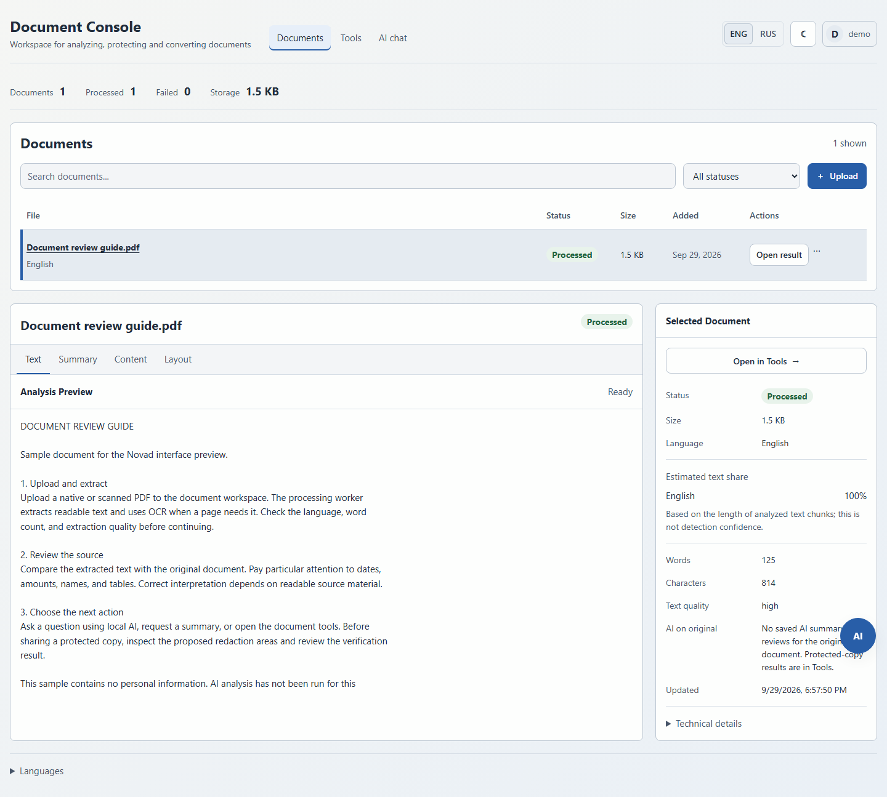
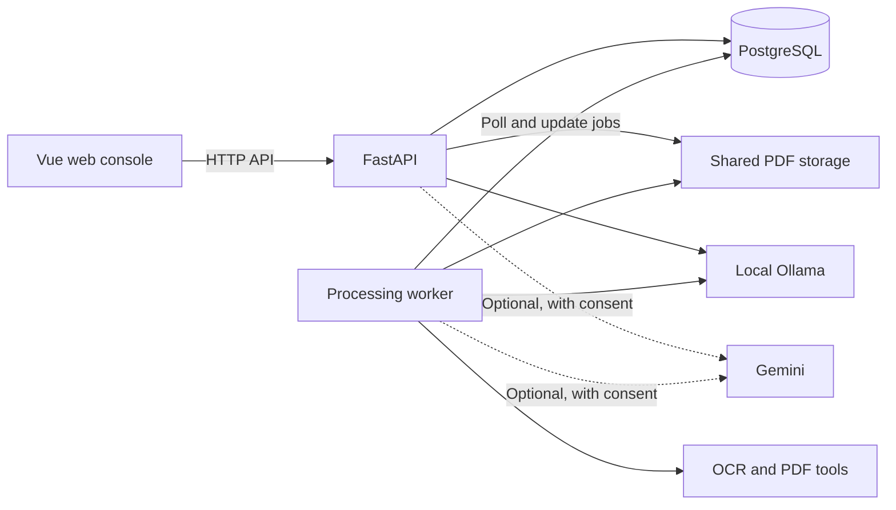

# Novad

A PDF workspace with multilingual OCR, local AI, and reviewable redaction.

Extract text from scanned documents, ask questions with source references, and inspect sensitive regions before creating a protected copy. Local AI runs through Ollama; Gemini is optional for external analysis or a second review.

[Get started](#quick-start) · [Architecture](#architecture) · [API guide](docs/api_endpoints.md) · [Development](docs/development.md) · [Tests](#tests-and-ci)



*Actual application running locally with a sample PDF processed by the backend. No personal documents or generated AI answers are shown. [View full-size screenshot](docs/assets/document-workspace.png).*

## Upload → review → use the result

1. **Upload a PDF.** The worker extracts native text or applies OCR for scanned pages, then reports processing progress and text quality.
2. **Review what was extracted.** Open the document to inspect its text and language metrics. For a protected copy, open Tools, review detected sensitive regions, and adjust the redaction rectangles.
3. **Use the result.** Ask local AI a question with source references, or apply redactions and download the protected PDF. Protected-copy AI analysis becomes available after the copy passes verification.

## What you can do

- **Read native and scanned PDFs** with Russian, Kazakh, and English OCR, extraction-quality checks, and a searchable document list.
- **Ask questions locally** or request summaries and reviews. Chat combines lexical search with local embeddings and returns source quotes and limitations.
- **Review sensitive data before sharing.** Local detection includes names, Kazakhstan identifiers, financial details, and visual regions. Confirmed redactions are rebuilt into an image-only PDF and re-scanned before protected AI analysis.
- **Prepare documents in one workspace:** compress PDFs, convert Word to PDF, or extract editable Word documents from PDFs. PDF-to-Word is beta.

The web console includes authenticated user workspaces, English/Russian translations, and light/dark themes.

## Architecture



The API handles authentication, documents, and interactive requests. A separate worker processes database-backed extraction, tool, and protected-AI jobs. Both share local file storage. PostgreSQL holds metadata, text chunks, and job state; no separate message broker is required.

| Layer | Main technologies |
| --- | --- |
| Backend | Python 3.12, FastAPI, SQLAlchemy 2, Alembic, PostgreSQL 16 |
| Frontend | Vue 3, TypeScript, Pinia, Vite; Node.js 24 for builds |
| Documents | PyMuPDF, OpenCV, Tesseract, LibreOffice, Ghostscript |
| Privacy and AI | Presidio, Stanza, Ollama; optional Gemini |
| Tests | pytest, Vitest, Playwright, GitHub Actions |

Implementation details: [hybrid retrieval](app/services/documents/retrieval.py), [protected-copy verification](app/services/documents/artifacts.py), and [persistent AI jobs](app/services/ai/jobs.py).

## Quick start

Use Docker Desktop, Docker Compose v2 with `!reset` support, and a running host Ollama instance for local AI. The commands below use PowerShell and assume a **new, empty database**.

```powershell
git clone https://github.com/btwamibatman/Novad.git
cd Novad
Copy-Item .env.example .env
```

Review `.env`: choose database credentials and update `DATABASE_URL` to match. Keep `AI_PROVIDER=ollama`; no Gemini key is needed. Follow the [host Ollama configuration](docs/development.md#2-prepare-local-ai), then download the models:

```powershell
ollama pull qwen3.5:4b
ollama pull qwen3-embedding:0.6b
```

Build, initialize the database, and create your sign-in account:

```powershell
docker compose up -d db
docker compose build api
docker compose run --rm api python -c "from app.core.database import init_db; init_db()"
docker compose run --rm api alembic upgrade head
docker compose run --rm api python -m app.create_user admin
docker compose up -d
```

The first build downloads OCR/NER dependencies. User creation prompts for a password. Open **[localhost:8000](http://localhost:8000)** and sign in; API documentation is at **[/docs](http://localhost:8000/docs)**. Keep the worker running for uploads and tool jobs to finish.

For existing databases, host development, service logs, stopping services, and the bundled frontend, see the [setup guide](docs/development.md). See [configuration](docs/configuration.md) for limits, model settings, and provider consent.

## Processing boundaries

Chat stays local. Protected-copy jobs support local analysis, Gemini analysis, or local analysis followed by a Gemini review. External modes require explicit consent; local inference failures do not trigger an automatic cloud fallback.

Automatic redaction checks can miss sensitive content, and matching a source quote does not prove an AI conclusion. Review the extracted text, protected copy, and results before relying on them. See the [protected-document workflow](docs/configuration.md#protected-documents-and-ai) for verification states and provider-file cleanup.

## Tests and CI

After installing the [development dependencies](docs/development.md#development), run backend tests from the repository root:

```powershell
python -m pytest -q
```

For frontend tests and a type-checked build:

```powershell
cd frontend
npm ci
npm test
npm run build
npx playwright install chromium
npm run test:e2e
```

[GitHub Actions](.github/workflows/ci.yml) runs these checks on pushes and pull requests. Backend tests use SQLite; browser tests use intercepted API responses. Live-model quality and full browser-to-backend integration are outside this suite. See the [test guide](tests/README.md) for coverage boundaries.

## Documentation

- [Setup and development](docs/development.md) — Docker, local Python/Vite, migrations, and repository structure.
- [Configuration and AI processing](docs/configuration.md) — environment settings, protected copies, and consent.
- [API guide](docs/api_endpoints.md) — main routes and an authenticated request example.
- [Test suite](tests/README.md) — setup, test organization, and verification limits.

## License

No license file is included in the repository.
